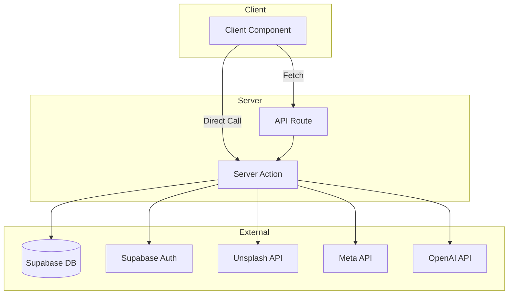

# 스니핏 (SNIPIT)

AI 기반 광고 레퍼런스 검색 및 경쟁사 모니터링 플랫폼

[서비스 바로가기](https://snipit-clone.vercel.app)


## 프로젝트 소개

스니핏은 마케터와 광고 기획자가 광고 레퍼런스를 수집하고 경쟁사의 활동을 실시간으로 파악할 수 있도록 돕는 플랫폼입니다. 수많은 광고 소재 사이에서 길을 잃지 않도록 AI가 최적의 레퍼런스를 추천하며, 복잡한 데이터 분석 과정을 시각화하여 한눈에 보여줍니다.

이 플랫폼은 마케터, 광고 기획자, 콘텐츠 크리에이터를 주요 사용자로 설정했습니다. 매일 쏟아지는 광고 데이터 속에서 인사이트를 빠르게 추출하고, 팀원들과 레퍼런스를 공유하며 협업할 수 있는 환경을 제공하는 것이 핵심 가치입니다.

단순한 클론 프로젝트를 넘어, 실제 서비스 수준의 사용자 경험과 데이터 흐름을 구현하는 데 집중했습니다.

## 주요 기능

| 아이콘 | 기능명 | 상세 설명 |
| :--- | :--- | :--- |
| 🔍 | 레퍼런스 검색 | 이미지 설명이나 카피라이트 텍스트로 광고를 검색합니다. 플랫폼 및 소재별 필터링과 Masonry 레이아웃을 지원합니다. |
| 📊 | 경쟁사 모니터링 | 경쟁사를 등록하여 플랫폼별 활동을 추적합니다. AreaChart와 DonutChart를 포함한 대시보드와 활동 캘린더를 제공합니다. |
| ✨ | AI 추천 | 매일 AI가 엄선한 8개의 광고 레퍼런스를 추천합니다. 각 광고마다 AI가 분석한 추천 이유를 함께 표시합니다. |
| 🧪 | 실험실 | 이미지 유사도 기반 레퍼런스 검색과 인스타그램 계정 분석 기능을 제공합니다. 팔로워, 참여율, 강점 등을 분석합니다. |
| 📁 | 보드 | 보드와 폴더를 생성하고 관리합니다. 마음에 드는 광고를 저장하고 썸네일 그리드 형태로 한눈에 확인할 수 있습니다. |
| 👤 | 프로필 | Google 로그인을 통한 계정 관리와 플랜 비교(Free/Light/Basic/Premium) 기능을 제공합니다. |
| 🏠 | 랜딩 페이지 | 서비스의 핵심 가치를 전달하는 마케팅 페이지입니다. Hero 섹션, 기능 소개, 요금제, 후기 등을 포함합니다. |
| 🧩 | 크롬 확장 | 웹 서핑 중에 발견한 광고 레퍼런스를 즉시 스니핏 보드에 저장할 수 있는 확장 프로그램입니다. |

## 기술 스택

| 카테고리 | 기술 | 버전 / 상세 |
| :--- | :--- | :--- |
| Framework | Next.js | 16.1.6 (App Router, Turbopack) |
| UI Library | React | 19.2.3 |
| Component Library | Mantine | v8.3.17 (Core, Charts, Dates, Form, Hooks, Notifications) |
| Backend/Auth | Supabase | Auth, PostgreSQL, RLS |
| Styling | Mantine + CSS Modules | Zero Tailwind 정책 |
| Charts | Mantine Charts | Recharts 3.8 기반 |
| Icons | Tabler Icons React | 3.40 |
| Date | dayjs | 1.11 |
| Language | TypeScript | 5 |
| Deployment | Vercel | CI/CD 자동화 |
| Font | SUIT / Pretendard | Variable Fonts 적용 |

## 아키텍처



### 페이지 구조
- `/landing`: 마케팅 랜딩 페이지 (독립 레이아웃)
- `/search`: 광고 레퍼런스 검색 및 필터링
- `/monitoring`: 경쟁사 대시보드 및 활동 추적
- `/ai`: AI 추천 광고 목록
- `/experiment`: 이미지 검색 및 인스타그램 분석
- `/board`: 저장된 레퍼런스 관리 (폴더/보드)
- `/profile`: 계정 설정 및 플랜 관리

## 프로젝트 구조

```
snipit-clone/
├── src/
│   ├── app/
│   │   ├── actions/      # 서버 액션 (데이터 처리 로직)
│   │   ├── api/           # API 라우트 (검색, 인스타그램 분석 등)
│   │   ├── auth/          # 인증 관련 콜백 핸들러
│   │   ├── landing/       # 마케팅 랜딩 페이지
│   │   └── [pages]/       # 서비스 주요 페이지 (search, monitoring, ai 등)
│   ├── components/
│   │   ├── layout/        # AppShell 및 사이드바 레이아웃
│   │   ├── cards/         # 광고 카드 및 UI 컴포넌트
│   │   ├── auth/          # 로그인 및 보호된 라우트 컴포넌트
│   │   └── common/        # 공통 UI (MasonryGrid, Paywall 등)
│   ├── hooks/             # 커스텀 훅 (인증, 상태 관리)
│   ├── utils/             # 유틸리티 (Supabase 클라이언트/서버 설정)
│   ├── theme/             # Mantine 테마 및 스타일 설정
│   ├── types/             # TypeScript 타입 정의
│   └── data/              # 목업 데이터 및 정적 데이터
├── supabase/
│   ├── schema.sql         # 데이터베이스 테이블 정의
│   └── rls.sql            # Row Level Security 정책
├── chrome-extension/      # 크롬 확장 프로그램 소스 코드
└── .env.local.example     # 환경 변수 설정 예시
```

## 시작하기

1. 저장소를 클론하고 의존성을 설치합니다.
   ```bash
   git clone https://github.com/your-repo/snipit-clone.git
   cd snipit-clone
   npm install
   ```

2. 환경 변수를 설정합니다. `.env.local.example` 파일을 복사하여 `.env.local` 파일을 생성하고 필요한 키를 입력합니다.

3. Supabase 프로젝트를 설정합니다.
   - Supabase 대시보드에서 새 프로젝트를 생성합니다.
   - `supabase/schema.sql` 내용을 SQL Editor에서 실행하여 테이블을 생성합니다.
   - `supabase/rls.sql` 내용을 실행하여 보안 정책을 적용합니다.
   - Authentication 메뉴에서 Google OAuth를 활성화합니다.

4. 개발 서버를 실행합니다.
   ```bash
   npm run dev
   ```
   > **Windows 참고**: `npm run dev` 실행 시 `0xc0000142` DLL 오류가 발생할 수 있습니다. 이 경우 아래 명령어를 사용하세요.
   ```bash
   npm run build && npm run start
   ```

5. 브라우저에서 `http://localhost:3000` 접속을 확인합니다.

## 데이터베이스 스키마

| 테이블명 | 설명 | 주요 컬럼 |
| :--- | :--- | :--- |
| `profiles` | 사용자 프로필 (auth.users 확장) | id, email, full_name, avatar_url, plan |
| `folders` | 보드 분류 폴더 | id, user_id, name |
| `boards` | 광고 레퍼런스 보드 | id, user_id, folder_id, name, description |
| `saved_ads` | 보드에 저장된 광고 | id, user_id, board_id, platform, image_url, brand_name, copy_text, media_type |
| `competitors` | 모니터링 대상 경쟁사 | id, user_id, name, platform, platform_id, country, is_active |
| `monitoring_data` | 수집된 광고 스냅샷 | id, competitor_id, image_url, ad_text, media_type, first_seen_at, last_seen_at |
| `search_history` | 사용자 검색 기록 | id, user_id, query, mode, results_count |

## API 구조

### Server Actions (`src/app/actions/`)

| 파일 | 함수 | 외부 API | 설명 |
| :--- | :--- | :--- | :--- |
| `search.ts` | `searchAds` | Unsplash API | 광고 레퍼런스 검색, 검색 기록 저장 |
| `boards.ts` | `getBoards`, `createBoard`, `updateBoard`, `deleteBoard` | - | 보드 CRUD |
| `folders.ts` | `getFolders`, `createFolder`, `updateFolder`, `deleteFolder` | - | 폴더 CRUD |
| `saved-ads.ts` | `saveAd`, `getSavedAds`, `removeSavedAd`, `moveAdToBoard` | - | 광고 저장/해제/이동 |
| `competitors.ts` | `getCompetitors`, `addCompetitor`, `removeCompetitor` | - | 경쟁사 등록/삭제 |
| `monitoring.ts` | `getMonitoringData`, `fetchMetaAdsLibrary`, `getMonitoringStats` | Meta Ads Library | 경쟁사 모니터링 데이터 조회 |
| `instagram.ts` | `analyzeInstagramAccount` | OpenAI (GPT-4o-mini) | 인스타그램 계정 분석 |

### API Routes (`src/app/api/`)

| 경로 | 메서드 | 설명 |
| :--- | :--- | :--- |
| `/api/search` | GET | 검색 Server Action의 HTTP 래퍼 |
| `/api/instagram/analyze` | POST | 인스타그램 분석 Server Action의 HTTP 래퍼 |

## 환경 변수

| 변수명 | 필수 여부 | 설명 | 획득처 |
| :--- | :--- | :--- | :--- |
| NEXT_PUBLIC_SUPABASE_URL | 필수 | Supabase 프로젝트 URL | Supabase Project Settings |
| NEXT_PUBLIC_SUPABASE_ANON_KEY | 필수 | Supabase 익명 키 | Supabase Project Settings |
| UNSPLASH_ACCESS_KEY | 선택 | 이미지 검색 API 키 | Unsplash Developers |
| META_ACCESS_TOKEN | 선택 | Meta 광고 라이브러리 API 토큰 | Meta for Developers |
| SUPABASE_SERVICE_ROLE_KEY | 선택 | Supabase 관리자 키 (서버 전용) | Supabase Project Settings |
| OPENAI_API_KEY | 선택 | AI 분석용 API 키 (GPT-4o-mini) | OpenAI Platform |

## 배포

이 프로젝트는 Vercel에 최적화되어 있습니다.
1. GitHub 저장소를 Vercel에 연결합니다.
2. 위 표에 명시된 환경 변수를 Vercel 프로젝트 설정에 등록합니다.
3. `main` 브랜치에 푸시하면 자동으로 배포가 진행됩니다.

## 디자인 시스템

- **Primary Color**: `snipitBlue` (#334FFF ~ #202fb4)
- **Font Stack**: `SUIT Variable`, `Pretendard Variable`
- **Platform Colors**:
  - Meta: Blue (rgba(0,114,235,0.3))
  - Instagram: Purple (rgba(162,49,193,0.29))
  - Google: Green (rgba(52,168,82,0.3))
  - TikTok: Black (rgba(0,0,0,0.29))
- **Styling Rule**: Mantine 컴포넌트와 CSS Modules만 사용하며, Tailwind CSS는 사용하지 않습니다.

## 라이선스 / 크레딧

- 본 프로젝트는 교육 및 포트폴리오 목적으로 제작된 `snipit.im` 클론 프로젝트입니다.
- 원본 서비스의 모든 권리는 **(주) 위시스트**에 있습니다.
